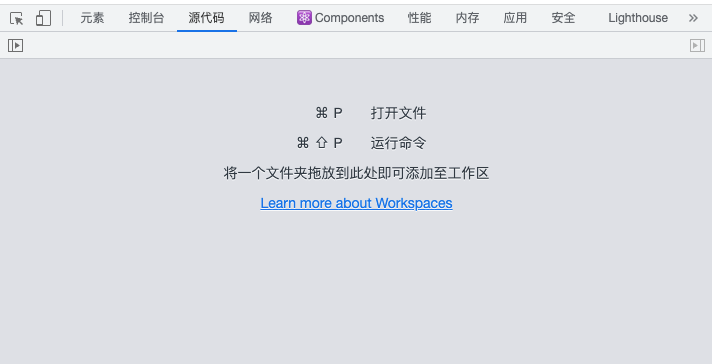
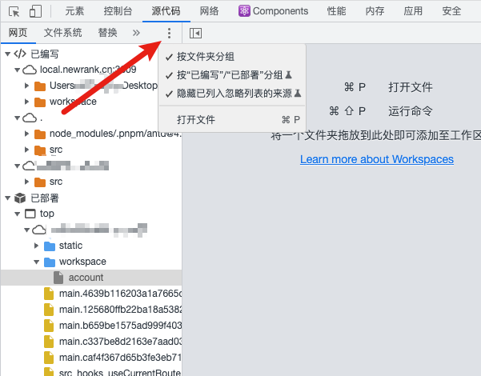

# 摆脱 console.log ，使用更优质的前端调试方案

本文会分享一些笔者学习到的前端调试方法，减少对 `console.log` 调试方式的依赖。

> 本文中提到的 `command` 键，在 Windows 系统中用 `control` 键替代即可

## 1. 为什么不用 console.log 一把梭

我们看一下使用  `console.log  `  的步骤：

* 找到需要调试代码的具体位置
* 写上一行 `console.log()` 代码，传入需要打印的变量
* 保存，等待项目热更新完成
* 打开控制台，查看打印的变量值
* 调试结束，删掉打印的那一行代码

平时使用中你可能没发现，原来限定条件这么多，调试变量需要这五个步骤一个都不能省。

遇到复杂的函数执行逻辑时，甚至要在每个函数中打印来确定函数的执行，这种情况下实在是不怎么方便。

> 简单的调试还是可取的，看个人调试习惯，较为复杂的调试就不推荐使用 `console.log` 了

## 2. 使用浏览器调试

在本地代码端，可以 通过添加一行 `debugger;` 命令，当代码执行到这一行，会自动进入调试模式

从**浏览器端**进行浏览器调试需要以下几个步骤：

* 打开 浏览器开发者工具的 `Sources` 源代码面板
* 找到需要调试的文件
* 打断点
* 进入 Debugger 模式，开始调试

### 2.1 找到需要调试的文件

在浏览器当中直接找调试文件有两种方式：**搜索文件调试** 和 **通过文件目录查找调试文件**

#### 2.1.1 搜索文件调试

如果没有打开的调试页，空页面中会当前浏览器查找文件的快捷键提示

以谷歌浏览器为例，可以通过 `command + P` **查找文件 **的方式打开需要调试的文件

按下 `command + p ` 快捷键后，搜索你要调试的文件，例如 `Component/index.tsx` , 即可打开对应的调试文件，接下来，就可以开始打断点了。在这一步下，最便捷的打断点方式就是点击需要调试代码的 **行号**，当代码指定到这行时，会自动进入浏览器的断点调试模式

#### 2.1.2 通过文件目录查找调试文件

点击左上角的图标，可以打开左侧菜单，推荐勾选上这三个筛选分类选项，在左侧 “网页” Tab 下，会实时展示加载模块的文件，找到需要调试的文件，接下来就可以开始调试了

### 2.2 打 JavaScript 断点

找到文件之后就可以开始打断点了，在浏览器中最便捷也是最常用的就是直接**点击行号**打断点，例如这里在点击事件这一行打了断点，当触发这个点击事件时，这个断点就会被触发了。

此外，右键行号也可以进行添加断点，它提供了更多的选项，例如：

* 条件断点，指定条件为 true 时才触发断点
* 日志点，记录消息
* 其他执行操作，执行到此处、不在此处暂停等

### 2.3 **Debugger** 调试

进入 `Debugger` 调试模式之后，源代码面板右侧的**调试控制台**上方有七个按钮，分别表示

1. 执行/暂停 
2. 跨步执行（运行下一行代码) 
3. JS执行下一步(忽略异步行为)
4. JS执行上一步(忽略异步行为)
5. 执行到函数末尾
6. 禁用所有断点
7.  启动/关闭错误时暂停执行

在Debugger 模式下可以查看 JavaScript 完整的执行过程，将鼠标移到执行过的变量上可以直接看到变量的值

在调试控制台下方的信息区域，可以查看断点的集合、当前函数的变量、全局变量、闭包和调用堆栈等信息

### 2.4 打 DOM 断点

给 DOM 元素添加断点，当DOM 元素发生变化时，会进入 debugger 模式，具体方法如下：

在控制台的 **元素** 标签页选中 DOM 节点，右键 选择发生中断的条件 可设置为属性修改 ，元素属性变化的时候，就会进入断点模式

## 3 使用 VsCode 调试

谷歌浏览器的 debugger 插件已经内置了，这里以火狐浏览器举例，步骤如下：

1. 安装 Debugger for Firefox

2. 左侧图标点击 **”调试”**，若无配置可添加配置，按照默认的添加 `lauch` 方式即可， 或者直接在根目录下创建一个 ` .vscode` 目录，里面新建一个 `launch.json` 文件，添加上配置, [官网调试文档]('https://go.microsoft.com/fwlink/?linkid=830387') 有必要一读, 以火狐举例:

   ~~~json
   {
     // 使用 IntelliSense 了解相关属性。 
     // 悬停以查看现有属性的描述。
     // 欲了解更多信息，请访问: https://go.microsoft.com/fwlink/?linkid=830387
     "version": "0.2.0",
     "configurations": [
       {
         "type": "firefox", // 浏览器类型
         "request": "launch", // 调试连接方式，launch 为新打开一个浏览器实例调试， attach 为附加到已打开的浏览器上
         "name": "firefox", // 调试配置的名称
         "url": "http://localhost:3009/", // 调试项目的主页地址
         "webRoot": "${workspaceFolder}/src", // 文件执行路径
         "pathMappings": [{ "url": "webpack:///src/", "path": "${webRoot}/" }],
         "profile": "default-release" // 可选配置， 火狐浏览器用户档案
       }
     ]
   }
   
   ~~~

    **profile 配置** 是可选的配置项，表示打开浏览器实例之后使用的用户档案，正常打开实例之后，会打开一个类似于进入了无痕窗口模式的浏览器，如果想正常进入浏览器，查看书签使用浏览器扩展，就需要这个配置项了

   在火狐的地址栏中输入`about:profiles` 可以看到所有的档案方案，这里我直接使用了默认的档案方案

配置完成后，打上断点，然后启动项目，点击调试按钮即可启动 VsCode 调试，执行到断点的地方会自动进入 VsCode 的调试模式，和浏览器中调试方式差不多

## 一些小技巧

#### console 打印

* 打印 **对象数组集合** 使用  `console.table` 可以更图表化的查看数据
* 打印 **DOM** 对象 使用 `console.dir` 可以打印出 **DOM** 节点的具体属性

#### 快捷键

`command + option + i`  快速打开 开发者工具 `源代码` 面板

`command + shift + c`，打开 开发者工具 `Element ` 面板，并启用 **元素审查**

#### 查看 `hover` 状态下的元素

打开控制台的 `source` （中文源代码) 面板，按下`command + \ `  会进入 **debugger** 模式

选中元素，在 `Element` 面板右键 选择强制执行状态 `:hover`

## 结语

关于学习前端调试，我认为一文读懂是不可能的，本文的一点内容算是抛砖引玉，供大家参考

奉上一句诗，很贴合调试的学习： **"纸上得来终觉浅，欲知此事要躬行"** 

我是饮东，欢迎点赞关注，我们江湖再会